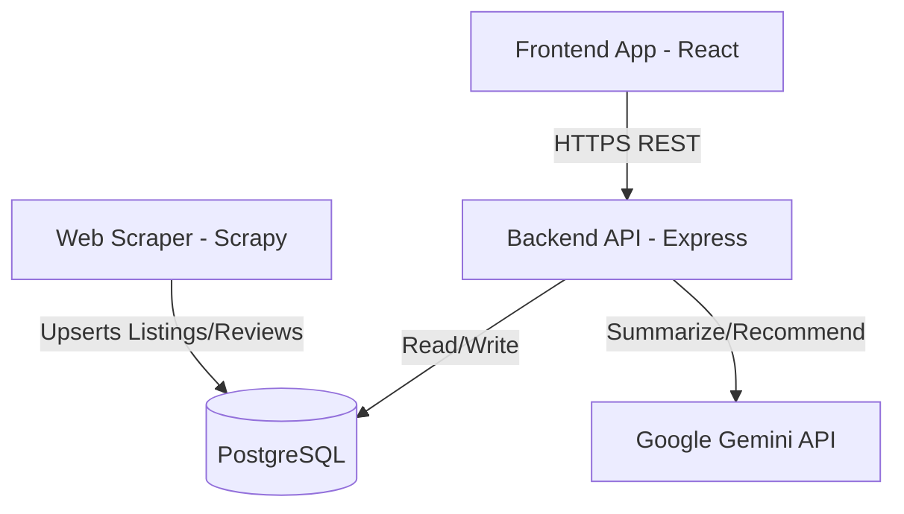

# ShopWise AI — Architecture Overview

ShopWise AI uses a decoupled monorepo architecture divided into distinct application, ingestion, and scheduling domains.

## Components

### 1. Backend (API Layer)
- **Runtime**: Node.js & Express
- **Database Access**: PostgreSQL via Prisma ORM
- **Authentication**: JWT stateful sessions (access & refresh tokens)
- **Integrations**: Google Gemini API for review sentiment scoring and recommendations

### 2. Frontend (User Interface)
- **Core Framework**: React (Single Page Application)
- **Build Engine**: Vite
- **Styling**: Tailwind CSS
- **Routing & State**: React Router DOM & Context API

### 3. Web Scraper (Data Ingestion)
- **Scraper framework**: Python Scrapy
- **Pipelines**: Cleans, parses, and upserts raw web data to the common Postgres schema

## Data Flow Diagram

